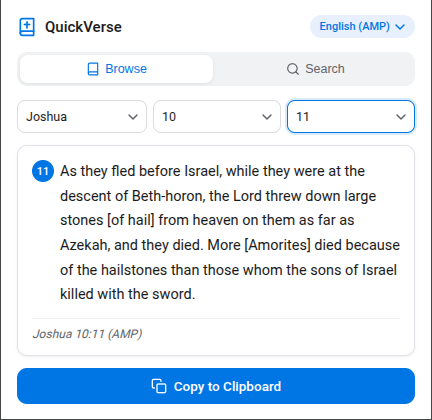
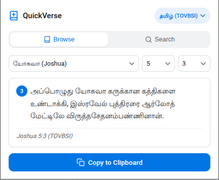
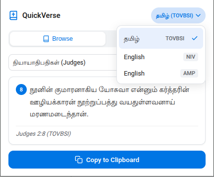

# QuickVerse

Chrome extension for browsing and copying Bible verses in **TOVBSI** (Tamil), **NIV** (English), and **AMP** (English).

## Why this exists

I take sermon notes in Google Docs. You know the drill — pastor mentions a verse, you alt-tab to Google, type it in, scan through results, copy the text, paste it in your doc, realise the formatting's wonky, fix it, alt-tab back. By then you've missed half the sermon.

I got tired of that dance. So I built this. One shortcut, pick the verse, copy, paste. Two seconds, back to your notes.

## Screenshots

| English (NIV & AMP) | Tamil (TOVBSI) | Switch translations |
|---|---|---|
|  |  |  |

## Features

- **3 translations** — TOVBSI (Tamil), NIV (English), AMP (English)
- **Browse mode** — pick Book → Chapter → Verse from dropdowns
- **Search mode** — type a reference like `John 3:16` and hit Enter
- **Instant copy** — click the button, then `Ctrl+V` wherever you need it
- **Keyboard shortcut** — `Ctrl+Shift+B` / `Cmd+Shift+B` to open the popup
- **Zero network** — everything runs locally, no API calls, no tracking, no data leaves your machine
- **Verse number badge** — clean display with the verse number in a circle

## Installation

### Chrome Web Store

Coming soon.

### Developer mode (for now)

1. Open `chrome://extensions/`
2. Enable **Developer mode** (toggle top-right)
3. Click **Load unpacked**
4. Select the `bible-extension/` folder

## Translations

| Translation | Language | Verses |
|---|---|---|
| TOVBSI | தமிழ் (Tamil) | 31,102 |
| NIV | English | 31,102 |
| AMP | English | 31,103 |

## Usage

1. Press `Ctrl+Shift+B` or click the extension icon
2. **Browse** — select a book, chapter, and verse from the dropdowns
3. **Search** — switch to the Search tab and type something like `Matthew 5:9`
4. **Switch translations** — click the badge in the top-right corner (says "தமிழ் (TOVBSI)" by default) and pick another version
5. **Copy** — click **Copy to Clipboard**, then paste (`Ctrl+V`) into your doc

## Privacy

QuickVerse collects nothing. No analytics, no network requests, no data sent anywhere. Clipboard access only happens when you click the copy button. All Bible data is bundled locally.
